# Open Discover® Platform Case Study
## Open Discover Platform is a higher level of document content extraction/processing API built upon the Open Discover SDK for .NET. 
### This repository show cases the following:
  - Using the Open Discover Platform API to process the Enron Microsoft Outlook PST Data Set published by EDRM and ZL Technologies, Inc. The data set is 189 PST files that total approximately 50GB in size.
  - Using a document database to store, index, and query the output produced by the Open Discover Platform API. In the study we use [RAVENDB 5.1](https://ravendb.net/) as our document database. RAVENDB 5.1 now allows for text attachments to be indexed; however, for this case study extracted text will be stored as a document record property and indexed. 
  - .NET WPF demo application (a C# application with source code available to those that demo Open Discover Platform) that uses custom RAVENDB indexes to query and display:
     - Summaries of a document counts, file types, file sizes
     - Charts of all documents counts by a "SortDate" (SortDate is a date calculated from either document metadata or document file system properties, and it usually represents the date the document owner last modified the document).
     - Summary of all languages found in all documents in the data set.
     - Summary of all sensitive items/entities found in all documents in the data set
     - Full-text search using RAVENDB
     - Searching for all documents that have a specific type of sensitive item (e.g., search for all documents with a bank account or IBAN numbers).
     - Many features of an early case assesment (ECA) application
  - Open Discover Platform API + document store such as RAVENDB or Elasticsearch leads to fast, easy, and powerful full-text search/eDiscovery/Information governance applications.   
### We chose the Enron Microsoft Outlook PST Data Set for the following reasons:
- It is a common benchmark dataset used in legal/eDiscovery/Information Governance industries (mostly for comparing document/attachment counts, de-duplication, and relative processing/indexing speeds)
- This data set still has, even after rounds of personally identifiable information cleansing, MUCH sensitive item information (PII) such as credit card numbers, social security numbers, IBAN accounts, investment account numbers, driver's licenses, and much more. Since it is an 'old' dataset (~20 years), and it is a publicly available dataset, those effected by the loss of personal information were long ago notified.
### Open Discover Platform API is purposed for multi-threaded processing of sets of documents (typically a set is 1000-5000 documents at a time). 'Processing' a set of documents includes:
- Identifying the file format types of each document
- Hashing the document bytes and/or content
- de-NIST-ing the documents (that is, comparing each document hash to a ~100M known NIST hash database of common/known files). 
- Extracting document text, metadata, and attributes
- Identifying the languages present in the extracted text
- Optionally, identifying sensitive items and entities present in the extracted text and metadata. Supported sensitive items include social security numbers, credit card numbers, bank account numbers, investment account numbers, IBAN, addresses, phone numbers, driver's license numbers, vehicle identification numbers (VIN), health care member numbers, and more
- If a document has an attachment or embedded item, then this child item is also processed through the above steps, this continues until no more child documents are left to process

A single instance of Open Discover Platform API is typically capable of processing document sets at 40-70 GB/hour rate* (* rates will be dependent on user hardware and file types in the dataset). It is very fast at processing documents while also extracting more content than most eDiscovery software (e.g., sensitive item/entity detection and de-NIST-ing while processing).
An Open Discover Platform API demo application, PlatformAPIDemo.exe, was used to process the Enron Outlook PST dataset. The PlatformAPIDemo.exe demo application wraps one instance of the Platform API document processing class. Screen shots of example PlatformAPIDemo.exe processing output are shown in the next section below. 

The PlatformAPIDemo.exe along with C# example projects for bulk inserting into RAVENDB, advanced RAVEBDB indexes, creating eDiscovery load files from Platform API output, and Lucene indexing Platform API output are distributed to companies that evaluate the Open Discover SDK and Platform API. 

In addition to the Open Discover Platform API offering, a 3rd party partner has developed a processing job management system (JMS) that manages distributed Platform API instances (and OCR worker instances) whether on separate desktops, virtual machines, or Azure Docker containers. By using distributed instances of the Platform API, customers can process terabytes of data a day on just one 16-core server. If you are in the legal/eDiscovery/information governance industries (or if your company routinely processes large volumes of documents) and are interested in demo-ing the JMS/Open Discover Platform then contact us at https://dotfurther.com/contact-us/.

### Quick look at the types of content that Open Discover Platform API extracted from the Enron Outlook PST dataset (i.e., the content which was bulk inserted into a RAVEDB document store):
The below screen shot shows an email (and its attachments) that was extracted and processed from one of the Enron Outlook PSTs. Note the calculated "SortDate" and document hashes and the extracted metadata:

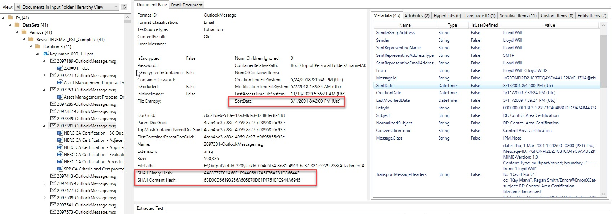

Email specific content like all recipients and extra hashes:

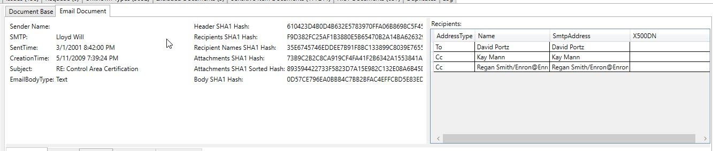

This processed email screen shot shows a bank account number that was extracted/identified as a "sensitive item" in the email's extracted text (all extracted text and all metadata are scanned for sensitive items):

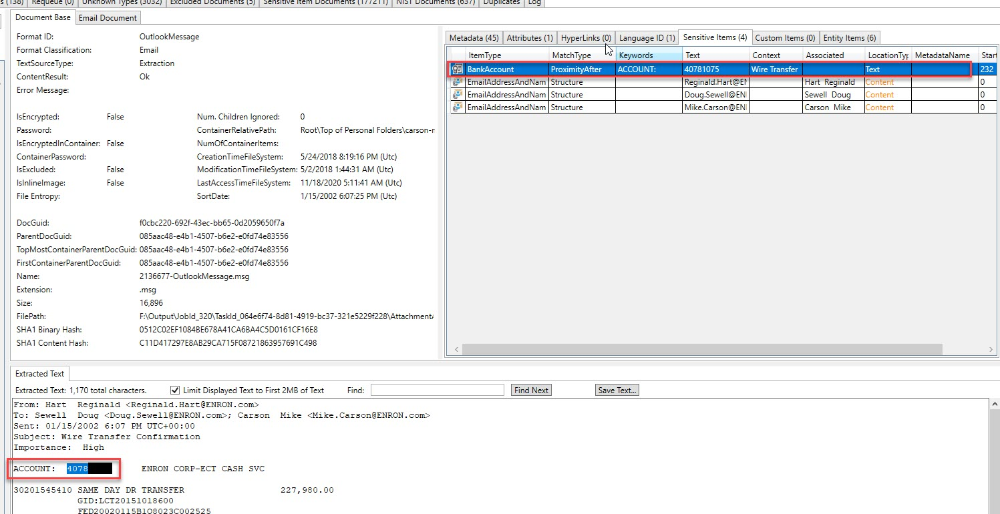

Some "entities" identified in a different email:

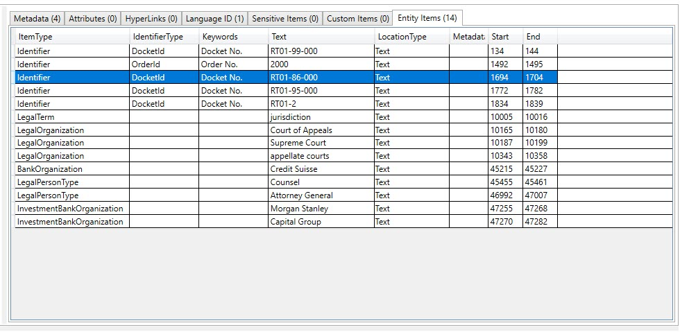

### Querying the document store (RAVENDB) with the .NET WPF demo

Some of the 31 RAVENDB indexes that the .NET WPF demo application uses to query the document store (note that there are 37.5 million metadata properties stored in this database in addition to all of the extracted text):

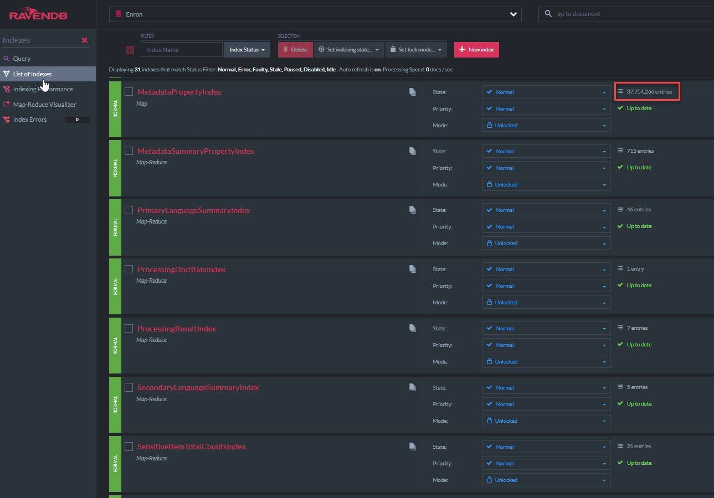

The .NET WPF demo application - the screen shot below shows the processing summary of the 189 Microsoft Outlook PST Enron data set (1,221,542 emails and attachments processed in total). Note the file types by file type classification pie chart, summary of file types by specific file format pie chart, and summary of processing results (Success/WrongPassword/DataError/etc) pie chart. 

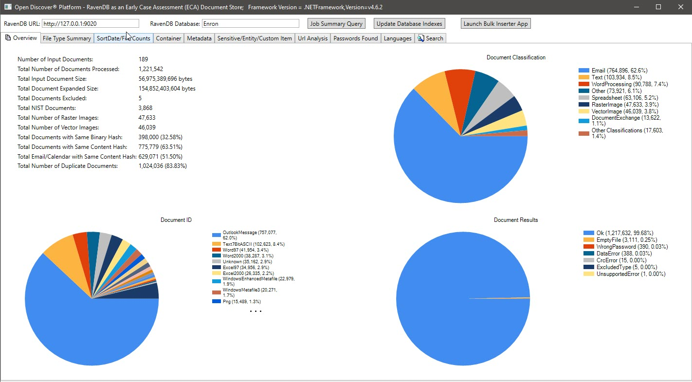

File counts by SortDate summary charts:

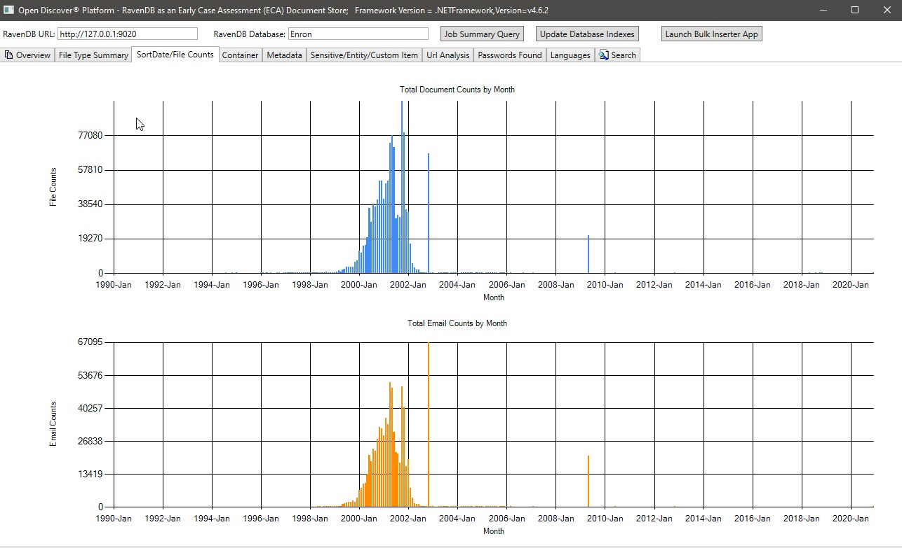

Metadata summary (metadata field name/total number of documents) - 715 known unique metadata field names across all documents and 636 custom (user defined) metadata fields:

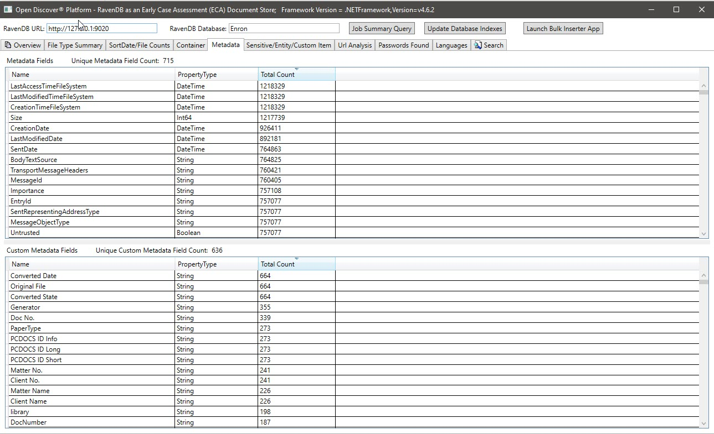

Sensitive Item/Entity Item Summary for all documents:

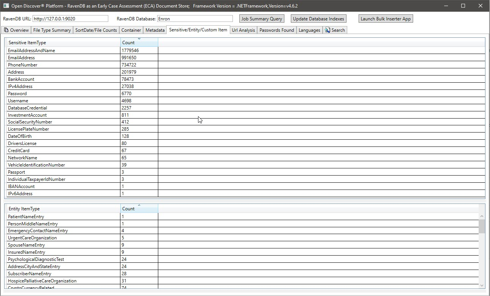

Summary of all unique URLs found in all documents:

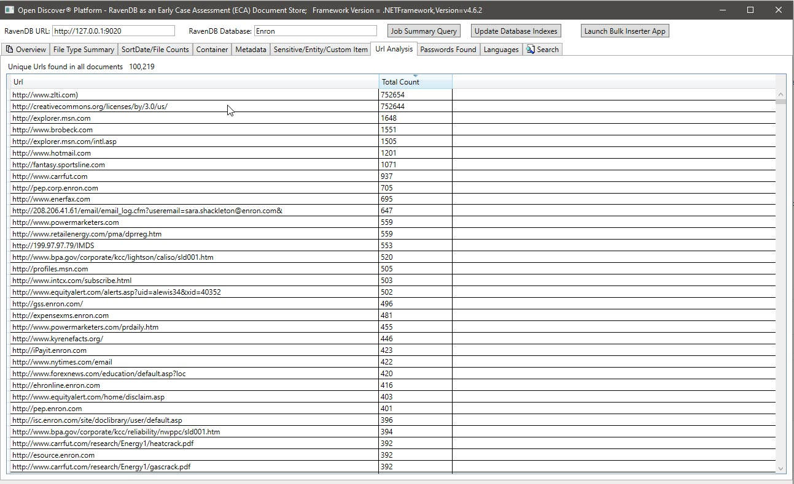

Summary of all passwords found in all documents (passwords and usernames are just 2 out of 22 'sensitive item' types supported by the Open Discover SDK/Platform). Password/username credentials in documents can be a security risk, they can also be used to re-process any document that has a processing result of 'WrongPassword' (as employees in the same company often email each other passwords to shared encrypted office documents):

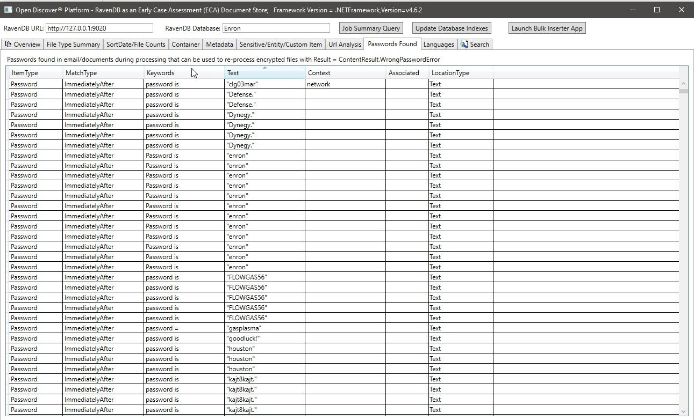

Summary of languages detected in the extracted text of the processed documents:

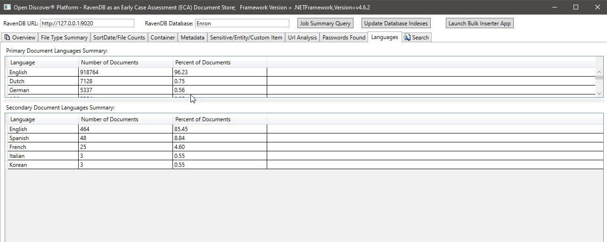

Example full-text search query (RAVENDB supports Lucene queries):

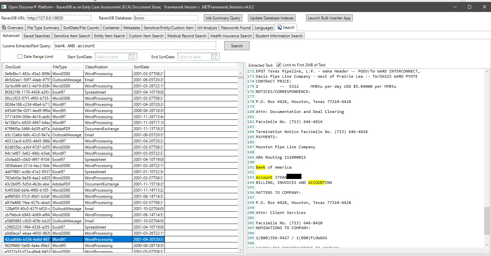

Example search by SensitiveItemType, in this example we search for all documents that have a sensitive item of type SensitiveItemType.BankAccount:

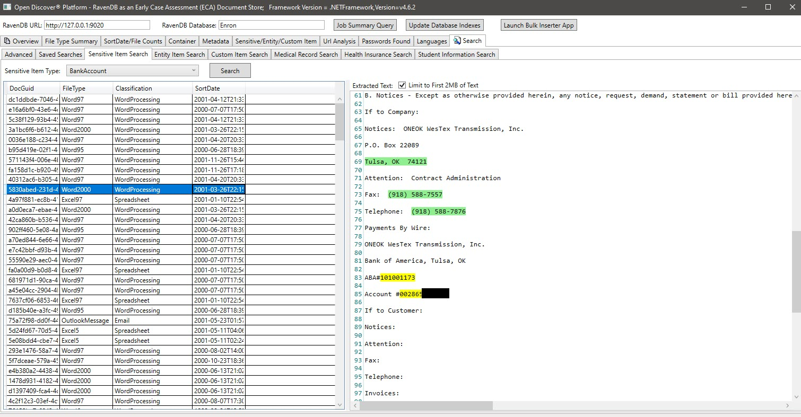

Example search by EntityItemType, in this example we search for all documents that have a entity item of type EntityItemType.PatientNameEntry:

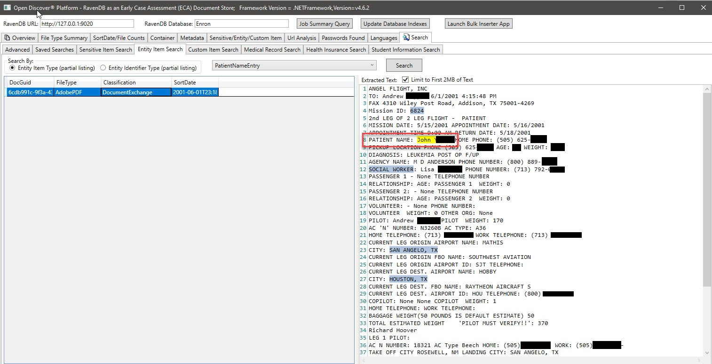

### Summary
Open Discover Platform output stored in a document database such as RAVENDB can lead to powerful full-text search/eDiscovery/information governance applications with little work. If this demo used a relational database instead of a document database, it would have taken months and not the 2 weeks in time it took the author to develop this proof of concept demo.

