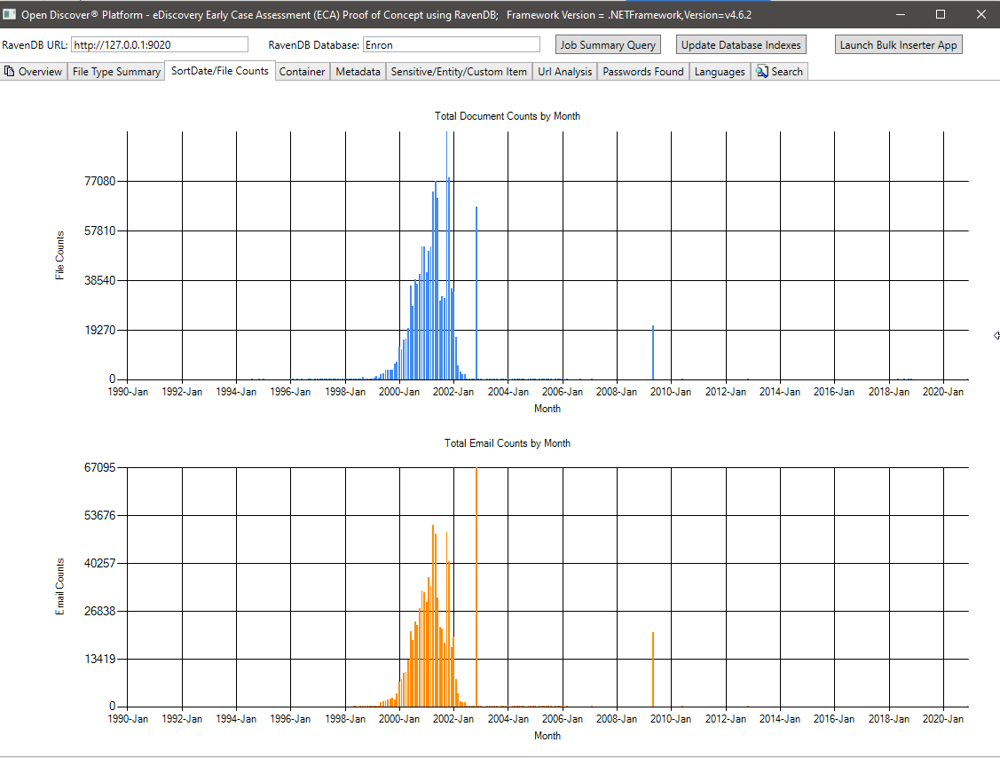
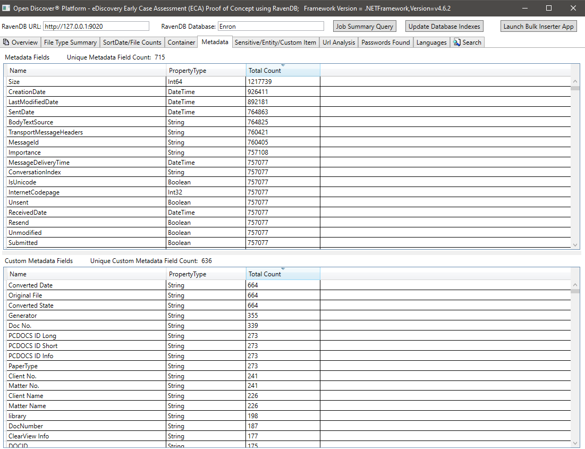
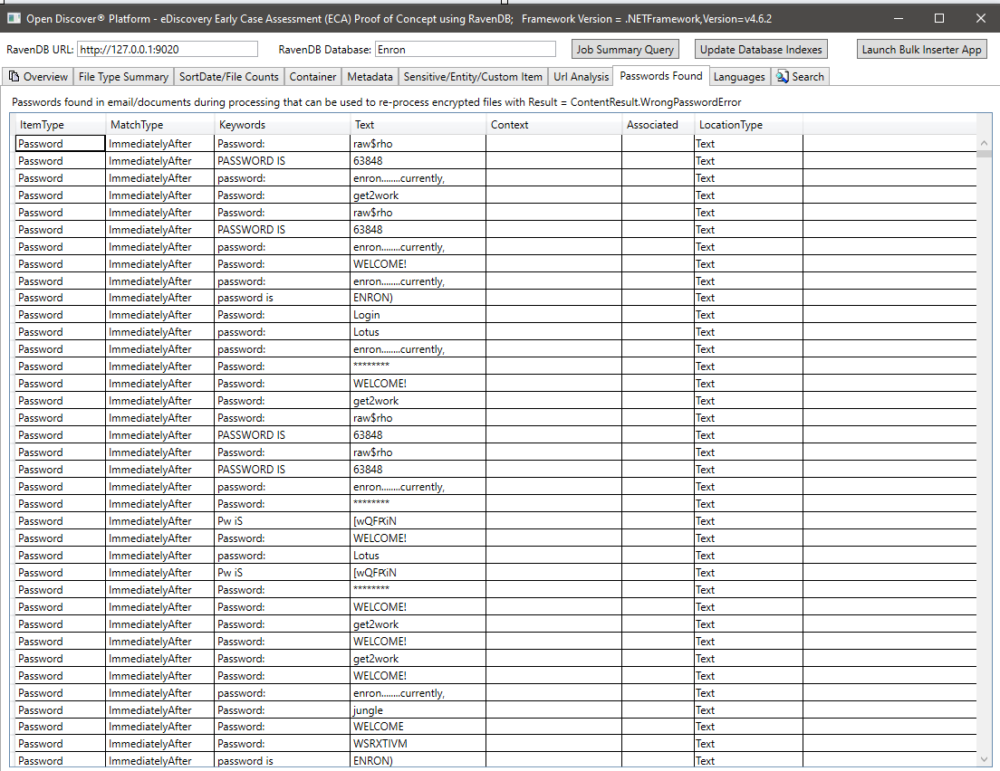

# Case Study: Use of Open Discover® Platform and RavenDB document store in eDiscovery Early Case Assessment (ECA). 

## [ECA](https://en.wikipedia.org/wiki/Early_case_assessment) "refers to estimating risk to prosecute or defend a legal case. Global organizations deal with legal discovery and disclosure requests for electronically stored information "ESI" and paper documents on a regular basis." 

## Open Discover® Platform is a higher level of document content extraction/processing API built upon the Open Discover® SDK for .NET. 

   See [Open Discover® SDK for .NET API Help](https://dotfurther.github.io/OpenDiscoverSDKHelp)
 
   See [Open Discover® SDK for .NET Examples GitHub Repository](https://github.com/dotfurther/OpenDiscoverSDK)

   
### This repository show cases the following:
  - Using the Open Discover Platform API to process the Enron Microsoft Outlook PST Dataset published by EDRM and ZL Technologies, Inc. The data set is 189 Microsoft Outlook PST (.pst) files that total approximately 53 GB in size. It is an open source dataset.
  - Using the RavenDB document database to store, index, and query the output produced by the Open Discover Platform API. In the study we use [RavenDB 5.1](https://ravendb.net/) as our document database. RavenDB 5.1 now allows for text attachments to be indexed; however, for this case study extracted text will be stored as a document record property and indexed. 
  - "eDiscovery Early Case Assessment (ECA) Proof of Concept" demo application (a C#/WPF application example with source code available to those that demo Open Discover Platform). From here on out we will refer to this demo application as the "ECA Demo App". This proof of concept demo app uses custom RavenDB indexes to query and display:
     - Summaries of a document counts, file types, file sizes
     - Charts of all documents counts by a "SortDate" (SortDate is a date calculated from either document metadata or document file system properties, and it usually represents the date the document owner last modified the document).
     - Summary of all languages found in all documents in the data set.
     - Summary of all supported sensitive items/entities found in all document text/metadata
     - Full-text search using RavenDB
     - Searching for all documents that have a specific type of sensitive item (e.g., search for all documents with a bank account or IBAN numbers).
     - Many features of an eDiscovery early case assessment (ECA) application 
  - Open Discover Platform API + document store such as RavenDB leads to fast, easy, and powerful full-text search/eDiscovery/Information governance applications.   
### We chose the Enron Microsoft Outlook PST Data Set for the following reasons:
- It is a common benchmark dataset used in legal/eDiscovery/Information Governance industries (mostly for comparing document/attachment counts, de-duplication, and relative processing/indexing speeds)
- This data set still has, even after rounds of personally identifiable information cleansing, MUCH sensitive item information (PII) such as credit card numbers, social security numbers, IBAN accounts, investment account numbers, driver's licenses, and much more. Since it is an 'old' dataset (~20 years), and it is a publicly available dataset, those effected by the loss of personal information were long ago notified.
### Open Discover Platform API is purposed for multi-threaded processing of sets of documents (typically a set is 1000-5000 documents at a time). 'Processing' a set of documents includes:
- Identifying the file format types of each document (1,540+ file formats supported for identification)
- Hashing the document bytes and/or content (document hashes are used to identify duplicate documents)
- de-NIST-ing the documents (that is, comparing each document hash to a ~100M known NIST hash database of common/known files). 
- Extracting document text, metadata, attributes, and child documents (attachments/embedded objects/container items)
- Identifying the languages present in the extracted text
- Identifying sensitive items and supported entity types present in the extracted text and metadata. Supported sensitive items include social security numbers, credit card numbers, bank account numbers, investment account numbers, IBAN, addresses, phone numbers, driver's license numbers, vehicle identification numbers (VIN), health care member numbers, and more. Open Discover SDK detects and extracts information on many entity types related to: medical records, health care/insurance, student records, legal matters, general accounts, gender, religion, general insurance, and emojis (emoji entities have their group, subgroup, and description returned).
- If a document has an attachment or embedded item, then this child item is also processed through the above steps, this continues until no more child documents are left to process (i.e., all documents/attachments/embedded items are completely processed and this includes supported container types such as archives and mail stores)

A single instance of Open Discover Platform API is typically capable of processing document sets at 40-70 GB/hour rate* (* rates will be dependent on user hardware and file types in the dataset). It is very fast at processing documents while also extracting more content than most eDiscovery software (e.g., sensitive item/entity detection and de-NIST-ing while processing).
An Open Discover Platform API demo application, PlatformAPIDemo.exe, was used to process the Enron Outlook PST dataset. The PlatformAPIDemo.exe demo application wraps one instance of the Platform API document processing class. Screen shots of example PlatformAPIDemo.exe processing output are shown in the next section below. 

The PlatformAPIDemo.exe is distributed with the Open Discover Platform evaluation along with:
  - Open Discover SDK for .NET and Platform assemblies
  - C# example project for bulk inserting into RavenDB
  - C# example project with advanced RavenDB indexes
  - "ECA Demo App" source code which use the above two listed RavenDB C# projects
  - C# example that creates eDiscovery review system "load files" from Platform API output
  - Lucene full-text search indexing example (indexes text/metadata/sensitive items from Platform API output)

In addition to the Open Discover Platform API offering, a 3rd party partner has developed a processing job management system (JMS) that manages distributed Platform API instances (and OCR worker instances) whether run on separate desktops, virtual machines, or Azure Docker containers. By using the JMS to manage distributed instances of the Platform API, customers can process terabytes of documents a day on just one 16-core server. If you are in the legal/eDiscovery/information governance industries (or if your company routinely processes large volumes of documents) and are interested in evaluating the JMS/Open Discover Platform then contact us at https://dotfurther.com/contact-us/.

In a recent performance test, the JMS processed the 53 GB Enron Microsoft Outlook PST dataset and bulk inserted the Platform API output (text/metadata/sensitive items/etc) into RavenDB in a little over 30 minutes on a 16-core Windows server. The JMS, 2 Platform API instances, 1 'worker' that bulk inserted task output into RavenDB, and RavenDB service were all running on the same 16-core server. That comes out to over 100+ GB/hour** processing rate just based on input document size and not expanded dataset size. 
** This test processing rate was for the .NET 4.62 version of SDK, the new .NET 5 version is > 100% faster.

### Quick look at the types of content that Open Discover Platform API extracted from the Enron Microsoft Outlook PST dataset (i.e., the types of content which was bulk inserted into a RavenDB document store for each document):

The screen shot below shows an email item (and its attachments) that was extracted from its Outlook PST container and processed by the PlatformAPIDemo.exe application. The email is from one of the Enron Microsoft Outlook PSTs. The tree view control on the left side of the image shows the parent/child hierarchy of all processed documents/containers, and clicking on a item in the tree control will show its extracted content. For the selected Outlook email item in the tree view, we can see that it has 6 MS Office Word documents as attachments that were extracted from the email. Each and every attachment/embedded item also had their content extracted (processing fully unrolls any parent child hierarchy, no matter how complex). Note the file format identification results, calculated "SortDate", various document hashes, the extracted metadata, and other tab items on the top right-hand side of image that contain other extracted content:

Email specific content like all recipients and extra hashes:

This processed email screen shot shows a bank account number that was extracted/identified as a "sensitive item" in the email's extracted text (all extracted text and all metadata are scanned for sensitive items):

Some "entities" identified and extracted in a different email. By inspecting the types of entities found in this email, we can surmise that the email is discussing a legal matter:

The "NativeDocument" class encapsulates what is fully extracted during processing and what is stored in the RavenDB Enron database:

### Querying the document store (RavenDB) with the "ECA Demo App"

The screen shot below shows the Enron database in RavenDB Studio populated with Platform API processed output. Only some of the database document fields stored in RavenDB could fit into the screen shot, there are many more fields. The column names with a red border annotation are collections of objects:

The screen shot below shows some of the 31 RavenDB indexes that the "ECA Demo App" uses to query the document store (note that the "MetadataPropertyIndex" shows that there are 37.7 million metadata properties stored in this database, mostly email metadata, in addition to all of the extracted text):

The "MetadataPropertyIndex" C# class code is displayed below. This index class derives from RavenDB's AbstractIndexCreationTask (as do all other indexes in this demo).  This index will allow Lucene 'like' queries on all metadata fields. A similar index for NativeDocument.CustomMetadata exists:

All C# defined RavenDB indexes get created in the RavenDB Enron database from the "ECA Demo App" via a simple RavenDB API call:

### The "ECA Demo App" 

The screen shot below shows the processing summary statistics of the 189 Microsoft Outlook PST Enron data set (1,221,542 emails and attachments processed in total). Most of the emails and attachments in this dataset are duplicate documents due to the fact that the Enron employees whose data was collected during the legal discovery phase were emailing each other back and forth - the deduplication statistics shown in image below was based on binary/content hash, in the future, we will update this case study (along with RavenDB indexes) to include the legal industry prefered "family deduplication". Note the file format classification pie chart, summary of specific file format pie chart, and summary of processing results (enumeration type with values of Ok/WrongPassword/DataError/etc) pie chart. 

File counts by SortDate summary charts:

Metadata summary (metadata field name/total number of documents) - 715 known unique metadata field names across all documents and 636 custom (user defined) metadata fields. This query can help legal case managers know what metadata fields are available in the collection to search on:

Sensitive Item/Entity Item Summary for all documents:

Summary of all unique URLs found in all documents (URLs from every document may be useful, for example, if a company wants to track down potential malicious url entry points). Open Discover SDK detects all URLs from document hyperlinks and in document text (i.e., non-hyperlink):

Summary of all passwords found in all documents. Passwords and usernames are just 2 out of 22 'sensitive item' types supported by the Open Discover SDK/Platform. Password/username credentials in documents can be a security risk, they can also be used to re-process any document that has a processing result of 'WrongPassword' (as employees in the same company often email each other passwords to shared encrypted office documents):

Summary of languages detected in the extracted text of the processed documents:

Example full-text search query (Note: RavenDB supports Lucene queries):

The above Lucene query, queries the ExtractedText field and uses (optionally) min/max document SortDate to filter the returned search results. It would be very easy to also add filtering of results by document FileType or document format Classification (WordProcessing/Spreadsheet/Email/etc). The C# code that performs the Lucene query looks like this:

During the ECA phase, legal review lawyers like to create many different search queries to find responding documents. The screen shot below shows a few saved Lucene queries and the results (number of document hits and total size of the documents). Note that the document counts in these user created searches contain duplicate document counts, although we have RavenDB indexes that count the number of duplicate documents, for this proof of concept, we have not yet "marked" documents in document store with a flag indicating master/duplicate (this is a 'TODO' by user):

Example search by SensitiveItemType (a property on detected SensitiveItem objects that identifies the type of sensitive item), in this example we search for all documents that have a sensitive item of type SensitiveItemType.BankAccount:

Example search by EntityItemType (a property on detected EntityItem objects that identifies the type of entity item), in this example we search for all documents that have a entity item of type EntityItemType.PatientNameEntry:

In the screen shot below, we use a specially created RavenDB index that indexes specific Open Discover SDK extracted entity types related to student information to find documents that may have student information (in the screen shot, the student's name and student ID are blacked out, the student ID appears to be a social security number which was common before the 2000's). Likewise, we have other special indexes to search for medical records and patient information:

### Summary
Open Discover Platform output stored in a document database such as RavenDB can lead to very powerful and rapidly developed legal early case assessment (ECA) applications. In addition, applications such as the following can also be rapidly developed:
- Powerful full-text search (including metadata and sensitive/entity item field searches)
- Information governance
- eDiscovery
- Data breach analysis
- Enterprise search and content management
- Content management systems
- IT Department applications - identify documents with sensitive information and/or that are redunant, obsolete, and trivial (ROT).

If this case study had used a relational database instead of a document database such as RavenDB, it would have taken months of database schema design and store procedure development and not the 2 weeks in time it took the author to develop this Early Case Assessment (ECA) proof of concept.

